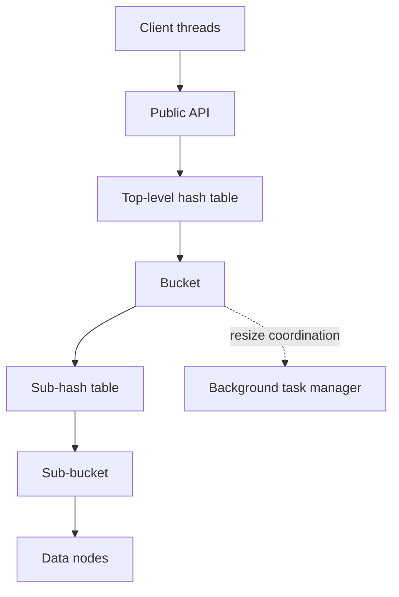

# High-Level Overview

The KeyStore is a single-process, in-memory storage engine written in C11. Its job is narrow and explicit: accept CRUD requests, route them quickly, and keep contention local enough to stay useful under multi-threaded load. The design favors a small runtime surface, predictable ownership, and concurrency that scales by partitioning work rather than by introducing a large coordination layer.

This is not a distributed system. There is no replication, consensus, persistence layer, or multi-node membership protocol in this codebase. The scope is strictly one process, one in-memory store. Future systems could build on this core storage engine, but that layer does not exist here.

## Table of Contents
- [1. What This Overview Covers](#1-what-this-overview-covers)
- [2. System Shape](#2-system-shape)
- [3. Layered Runtime View](#3-layered-runtime-view)
- [4. Layer Responsibilities](#4-layer-responsibilities)
- [5. Major Runtime Components](#5-major-runtime-components)

## 1. What This Overview Covers

This section stays at the system-shape level:

- what the keystore is responsible for
- which runtime components participate in a request
- which design constraints define the current system boundary
- where to read next for the deeper mechanics

Hash formulas, lock-by-lock behavior, resize choreography, and data-structure internals are intentionally delegated to the later sections in this directory.

## 2. System Shape



## 3. Layered Runtime View

```text
┌──────────────────────────────────────────────────────────────┐
│ ENTRY LAYER                                                  │
│ key_store.c                                                  │
│ - Public CRUD API and request validation                     │
│ - Computes routing hashes and dispatches the request         │
└───────────────────────────────┬──────────────────────────────┘
                                │
                                ▼
┌──────────────────────────────────────────────────────────────┐
│ HASH-TABLE LAYER                                             │
│ hash_table_operation.c, hash_bucket_operation.c              │
│ - Selects the top-level bucket from bucket hash              │
│ - Owns bucket-level coordination and resize boundary         │
└───────────────────────────────┬──────────────────────────────┘
                                │
                                ▼
┌──────────────────────────────────────────────────────────────┐
│ SUB-HASH-TABLE LAYER                                         │
│ sub_hash_table_operation.c, sub_hash_bucket_operation.c      │
│ operation_handlers/*                                         │
│ - Selects the sub-bucket from sub-bucket hash                │
│ - Executes read/write/delete paths with sub-bucket locks     │
└───────────────────────────────┬──────────────────────────────┘
                                │
                                ▼
┌──────────────────────────────────────────────────────────────┐
│ DATA-NODE LAYER                                              │
│ data_node_operation.c, linked_list_operation.c,              │
│ bloom_filter_operation.c                                     │
│ - Stores key/value/deletion state                            │
│ - Maintains collision chains and miss-fast filtering         │
└──────────────────────────────────────────────────────────────┘
```

## 4. Layer Responsibilities

| Layer | Main responsibility | Primary modules |
|---|---|---|
| Entry | Validate input, expose CRUD API, compute dual hashes, and route requests | `core/key_store.c`, `hash/hash_functions.c` |
| Hash-table | Partition keyspace into buckets and coordinate bucket-local resizing | `hash_table/hash_table_operation.c`, `hash_table/hash_bucket_operation.c`, `hash_table/resizing/*` |
| Sub-hash-table | Route into sub-buckets and run lock-aware read/write/delete handlers | `sub_hash_table/sub_hash_table_operation.c`, `sub_hash_table/sub_hash_bucket_operation.c`, `sub_hash_table/operation_handlers/*` |
| Data-node | Hold record state and collision-chain nodes used by sub-bucket operations | `data_structures/data_node_operation.c`, `data_structures/linked_list_operation.c`, `data_structures/bloom_filter_operation.c` |

```
┌─────────────────────────────────────────────────────────────────┐
│                        CLIENT THREADS                           │
│                  set_key / get_key / delete_key                 │
└───────────────────────────┬─────────────────────────────────────┘
                            │
                            ▼
┌─────────────────────────────────────────────────────────────────┐
│                     PUBLIC API (key_store.c)                    │
│    Validates input → Dual MurmurHash3-64 → Routes to bucket     │
└───────────────────────────┬─────────────────────────────────────┘
                            │
                            ▼
┌─────────────────────────────────────────────────────────────────┐
│                 HASH TABLE (hash_table_operation.c)             │
│          bucket_index = bucket_hash % total_buckets             │
│   ┌──────────┬──────────┬──────────┬───────┬──────────┐         │
│   │ Bucket 0 │ Bucket 1 │ Bucket 2 │  ...  │ Bucket N │         │
│   └────┬─────┴────┬─────┴────┬─────┴───────┴────┬─────┘         │
└────────┼──────────┼──────────┼───────────────────┼──────────────┘
         │          │          │                   │
         ▼          ▼          ▼                   ▼
┌─────────────────────────────────────────────────────────────────┐
│         HASH BUCKET (hash_bucket_operation.c)                   │
│   Each bucket owns a sub-hash-table + manages resizing          │
│   Lock: pthread_mutex_t resizing_lock                           │
└───────────────────────────┬─────────────────────────────────────┘
                            │
                            ▼
┌─────────────────────────────────────────────────────────────────┐
│           SUB-HASH-TABLE (sub_hash_table_operation.c)           │
│        sub_index = sub_bucket_hash & (sub_buckets - 1)          │
│   ┌────────────┬────────────┬────────────┬────────────┐         │
│   │ Sub-Bkt 0  │ Sub-Bkt 1  │ Sub-Bkt 2  │ Sub-Bkt M  │         │
│   └─────┬──────┴─────┬──────┴─────┬──────┴─────┬──────┘         │
└─────────┼────────────┼────────────┼────────────┼────────────────┘
          │            │            │            │
          ▼            ▼            ▼            ▼
┌─────────────────────────────────────────────────────────────────┐
│         SUB-HASH-BUCKET (sub_hash_bucket_operation.c)           │
│   Singly-linked list of data nodes (collision chain)            │
│   Lock: pthread_rwlock_t sub_hash_bucket_lock                   │
│                                                                 │
│     ┌────────┐    ┌────────┐    ┌────────┐                      │
│     │ LLNode ├───►│ LLNode ├───►│ LLNode ├───► NULL             │
│     │(hash,  │    │(hash,  │    │(hash,  │                      │
│     │ data*) │    │ data*) │    │ data*) │                      │
│     └───┬────┘    └───┬────┘    └───┬────┘                      │
│         │             │             │                           │
│         ▼             ▼             ▼                           │
│     ┌────────┐    ┌────────┐    ┌────────┐                      │
│     │DataNode│    │DataNode│    │DataNode│                      │
│     │key,val │    │key,val │    │key,val │                      │
│     │ mutex  │    │ mutex  │    │ mutex  │                      │
│     └────────┘    └────────┘    └────────┘                      │
└─────────────────────────────────────────────────────────────────┘
```

At a high level, each request moves through a thin API layer into a partitioned in-memory index. The top-level hash table spreads work across buckets. Each bucket owns a smaller internal table that contains the actual collision chains. Resize work is localized to the bucket under pressure instead of forcing a whole-table rebuild.

That shape gives the project three useful properties:

- concurrency is mostly local to a bucket or sub-bucket instead of global
- growth work is incremental because only hot buckets resize
- the public API remains small while the internal storage path can evolve

## 5. Major Runtime Components

| Component | Role in the system | Details live in |
|---|---|---|
| Public API | Validates caller input, computes routing hashes, and exposes the CRUD surface | [03-data-flow.md](03-data-flow.md), [API.md](../../API.md) |
| Top-level hash table | Partitions the keyspace into independently managed buckets | [04-two-level-hash-table.md](04-two-level-hash-table.md) |
| Bucket | Owns one sub-hash table and acts as the boundary for resize coordination | [04-two-level-hash-table.md](04-two-level-hash-table.md), [08-dynamic-resizing.md](08-dynamic-resizing.md) |
| Sub-hash table and sub-buckets | Hold the actual collision paths and per-partition lookup state | [05-data-structures.md](05-data-structures.md) |
| Data nodes | Store key, value, and deletion state for each logical record | [05-data-structures.md](05-data-structures.md), [09-memory-management.md](09-memory-management.md) |
| Background task manager | Supports asynchronous or deferred work associated with resize flow | [10-background-task-manager.md](10-background-task-manager.md) |

## Architectural Priorities

The implementation follows a set of priorities that are common in high-throughput open-source storage engines:

| Priority | Why it matters here |
|---|---|
| Partition first | Independent buckets reduce cross-thread interference and keep hot paths short |
| Resize locally | Growth is constrained to overloaded regions instead of penalizing the full table |
| Keep the API thin | Most complexity stays behind a small public surface, which limits coupling |
| Separate fast path from maintenance work | Request handling remains focused while cleanup and resize support can evolve independently |
| Prefer practical correctness over aggressive reclamation | Soft-delete semantics avoid invalidating readers during concurrent access |

## Current System Boundary

Several constraints are important at the overview level because they shape every other design choice:

| Boundary | Current state | Follow-up detail |
|---|---|---|
| Deployment model | Single process, single in-memory keystore instance | [DESIGN_DECISIONS.md](../DESIGN_DECISIONS.md) |
| Object lifetime | Global initialization and teardown govern the entire store | [09-memory-management.md](09-memory-management.md) |
| Concurrency model | Fine-grained synchronization is optional and configuration-driven | [07-concurrency-model.md](07-concurrency-model.md) |
| Durability | No WAL, snapshots, or crash recovery in the current implementation | [DESIGN_DECISIONS.md](../DESIGN_DECISIONS.md) |
| Distribution | No network protocol, replication, or consensus layer yet | [DESIGN_DECISIONS.md](../DESIGN_DECISIONS.md) |

## Process Model

The keystore is implemented as a process-wide singleton rather than as a reusable instance object.

- `initialise_key_store()` creates or reuses the one global store
- CRUD operations target that global state for the lifetime of the process
- `cleanup_key_store()` tears the store down and returns the runtime to an uninitialized state

This is one of the most important architectural constraints in the codebase. It simplifies API usage and internal ownership, but it also prevents multiple independent keystore instances from coexisting inside one process.

## Reading Guide

Use the rest of this architecture set in the same order many open-source projects structure their design docs: broad shape first, then mechanics by concern.

1. Read [02-directory-structure.md](02-directory-structure.md) to map source folders to responsibilities.
2. Read [03-data-flow.md](03-data-flow.md) for request lifecycle walkthroughs.
3. Read [04-two-level-hash-table.md](04-two-level-hash-table.md) and [05-data-structures.md](05-data-structures.md) for the storage layout.
4. Read [07-concurrency-model.md](07-concurrency-model.md) and [08-dynamic-resizing.md](08-dynamic-resizing.md) for the behavior that dominates correctness under load.
5. Read [09-memory-management.md](09-memory-management.md), [10-background-task-manager.md](10-background-task-manager.md), and [DESIGN_DECISIONS.md](../DESIGN_DECISIONS.md) for lifecycle, maintenance work, and design rationale.
