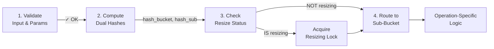
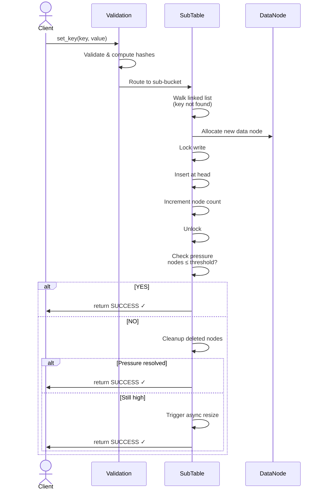
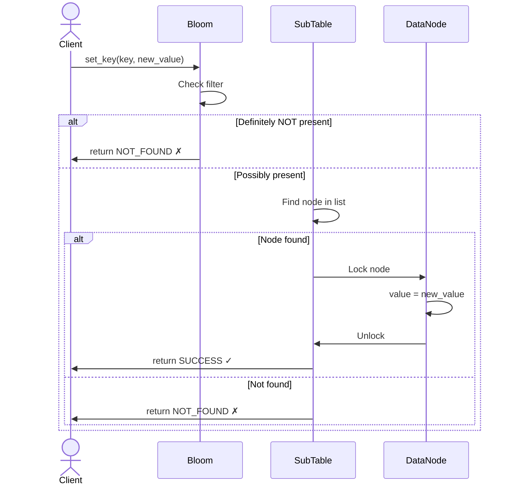
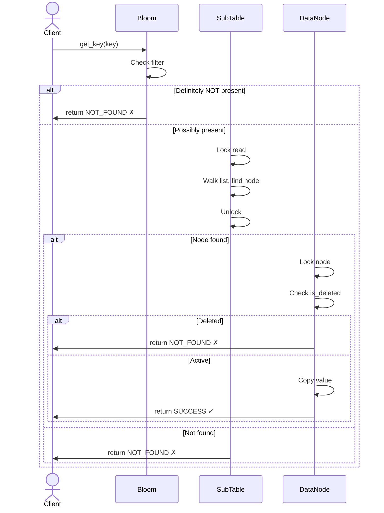
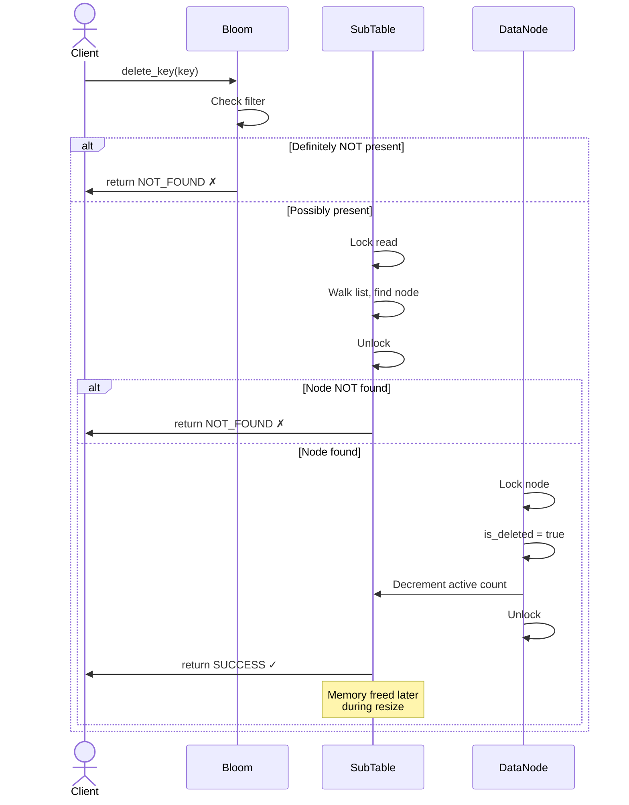
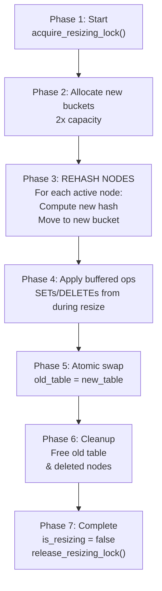
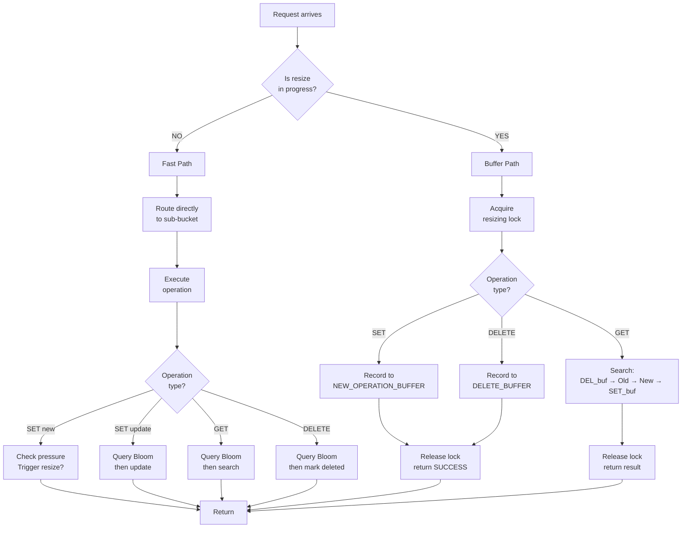

# Data Flow

How a Request Travels

## Table of Contents
- [1. Quick Reference: Core Operations](#1-quick-reference-core-operations)
- [2. Core Path: All Operations Follow These Steps](#2-core-path-all-operations-follow-these-steps)
- [3. SET: Adding a New Key](#3-set-adding-a-new-key)
- [4. SET: Updating an Existing Key](#4-set-updating-an-existing-key)
- [5. GET: Retrieving a Value](#5-get-retrieving-a-value)
- [6. DELETE: Soft-Delete Strategy](#6-delete-soft-delete-strategy)
- [7. Background Resize: How Table Growth Works](#7-background-resize-how-table-growth-works)

## 1. Quick Reference: Core Operations

| Operation | Normal Flow | What Changes During Resize |
|-----------|------------|----------------------------|
| **SET** (new key) | Validate → Hash → Allocate → Lock → Insert → Check pressure | Record to NEW_OPERATION_BUFFER (applied in Phase 4) |
| **SET** (update key) | Validate → Hash → Bloom filter → Find → Acquire mutex → Update value | Record to NEW_OPERATION_BUFFER (applied in Phase 4) |
| **GET** | Validate → Hash → Bloom filter → Lock → Walk list → Copy value | Search: DELETE_buf → Old → New → SET_buf |
| **DELETE** | Validate → Hash → Bloom filter → Find → Acquire mutex → Mark deleted | Record to DELETE_BUFFER (applied in Phase 4) |

---

## 2. Core Path: All Operations Follow These Steps

Every operation starts the same way:



---

## 3. SET: Adding a New Key

**Happy path (pressure below threshold):**



---

## 4. SET: Updating an Existing Key

**Simple in-place update (no struct changes):**



---

## 5. GET: Retrieving a Value

**Optimized with Bloom filter (when NOT resizing):**

> **Note:** Bloom filter is used in ALL find operations (GET, SET-update, DELETE) to quickly reject non-existent keys without acquiring locks.



---

## 6. DELETE: Soft-Delete Strategy

**Two-phase: Find (with Bloom filter), then Mark (no immediate cleanup):**



---

## 7. Background Resize: How Table Growth Works

**Triggered when**: New nodes cause chain length to exceed threshold

> **Critical:** Resize trigger is **ONLY checked when a NEW key is added** via SET.
> - SET (new key) → Check pressure after insert → Trigger if needed
> - SET (update key) → No pressure check (node count unchanged)
> - GET → No pressure check (read-only, no resize impact)
> - DELETE → No pressure check (marked deleted, not removed immediately)

**Process** (7 phases):



**What "Rehash" means:**
- Each active data node is visited
- Deleted nodes are skipped (not copied)
- New hash position computed: `new_index = hash(key) % new_capacity`
- Node is moved to new bucket in new table (physically relocated)
- Linked list at old bucket is NOT modified during this phase

**Phase 4 Detail: Draining the Buffers**

After all nodes are rehashed, two buffers are processed:

```
NEW_OPERATION_BUFFER (operations recorded during resize):
  For each (key, value, is_update) in NEW_OPERATION_BUFFER:
    If is_update:
      Find key in new table → update value in-place
    Else (new key):
      Allocate new node → insert into new table
      
DELETE_BUFFER (operations recorded during resize):
  For each key in DELETE_BUFFER:
    Find key in new table (or NEW_OPERATION_BUFFER if just added)
    Mark as is_deleted = true
    Decrement active count
```

Order matters:
1. **First**: All SETs from NEW_OPERATION_BUFFER applied to new table
2. **Then**: All DELETEs from DELETE_BUFFER mark nodes as deleted
3. **Result**: New table is now the complete, consistent view

---

## Resize Buffer Workflow: Visual

**State during Phases 1-3 (Before buffers are drained):**

```
┌─────────────────────────────────────────────────────────────┐
│ SYSTEM STATE DURING ACTIVE RESIZE (Before Phase 4)          │
├─────────────────────────────────────────────────────────────┤
│                                                             │
│  OLD TABLE (Original)              NEW TABLE (Being built)  │
│  ┌──────────────────┐              ┌─────────────────────┐  │
│  │ node_A (active)  │              │ node_A (rehashe)    │  │
│  │ node_B (active)  │              │ node_D (rehashed)   │  │
│  │ node_C (deleted) │              │                     │  │
│  │ node_D (active)  │              │ (Rehashed from old) │  │
│  └──────────────────┘              └─────────────────────┘  │
│   ↑ IMMUTABLE                       ↑ GROWING               │
│   Nodes are read                    Empty nodes created     │
│                                                             │
├─────────────────────────────────────────────────────────────┤
│                                                             │
│  NEW_OPERATION_BUFFER          DELETE_BUFFER                          │
│  ┌────────────────┐  ┌──────────────┐                       │
│  │ SET alice:20   │  │ DELETE bob   │                       │
│  │ SET bob:25     │  │              │                       │
│  │ SET eve:30     │  │              │                       │
│  └────────────────┘  └──────────────┘                       │
│   ↑ GROWING          ↑ GROWING                              │
│   From SET ops       From DELETE ops                        │
│                                                             │
└─────────────────────────────────────────────────────────────┘

Incoming GET operations:
  • Must check: DELETE_BUFFER → Old → New → NEW_OPERATION_BUFFER
  • If found in DELETE_BUFFER → return NOT_FOUND
  • Otherwise continue searching
```

**State after Phase 4 (Buffers drained to new table):**

```
┌─────────────────────────────────────────────────────────────┐
│ AFTER PHASE 4: BUFFERS APPLIED TO NEW TABLE                 │
├─────────────────────────────────────────────────────────────┤
│                                                              │
│  NEW TABLE (Complete & Consistent)                          │
│  ┌────────────────────────────────┐                         │
│  │ node_A (rehashe, value=20)     │ ← Updated by SET       │
│  │ node_B (rehashe, is_deleted=1) │ ← Marked by DELETE     │
│  │ node_D (rehashe)               │                         │
│  │ node_eve (new)                 │ ← Added by SET         │
│  └────────────────────────────────┘                         │
│   ↑ FINALIZED                                              │
│   Ready to become active table                             │
│                                                              │
│  NEW_OPERATION_BUFFER: EMPTY (drained)                               │
│  DELETE_BUFFER: EMPTY (drained)                            │
│                                                              │
└─────────────────────────────────────────────────────────────┘

After Phase 5 (atomic swap):
  • new_table becomes the active table
  • Incoming operations use new table directly
```

---


**What operations do during resize:**

| Operation | Action | Buffer |
|-----------|--------|--------|
| **SET (new or update)** | Record to buffer | NEW_OPERATION_BUFFER |
| **GET** | Search: DELETE_buffer → old → new → SET_buffer | (reads buffers) |
| **DELETE** | Record to buffer | DELETE_BUFFER |

- **NEW_OPERATION_BUFFER**: Holds all SET operations (both new keys and updates) during resize
- **DELETE_BUFFER**: Holds all DELETE operations during resize (separate from SET buffer)
- **GET**: Does NOT go to buffer; instead it queries buffers to find latest state
- Operations recorded in buffers, applied in Phase 4

---

## Concurrency: Three Locks Protect Different Concerns

### Lock 1: Sub-Bucket Read/Write Lock
- **Protects**: Linked list structure (add/remove nodes)
- **Multiple readers** allowed (concurrent GETs, reads safe)
- **Single writer** allowed (exclusive when adding/removing)
- **When acquired**:
  - **Read**: Finding a node in GET or DELETE
  - **Write**: Inserting a new node in SET

### Lock 2: Data Node Mutex
- **Protects**: `value` field and `is_deleted` flag
- **Always held** when reading or modifying the value
- **When acquired**:
  - **SET**: Updating existing value
  - **GET**: Reading and checking `is_deleted`
  - **DELETE**: Setting `is_deleted = true`

### Lock 3: Resizing Lock (Binary)
- **Protects**: Consistency during resize operations
- **Serializes**: Regular operations vs. resize process
- **When acquired**: All operations check if resize in progress
  - **If YES**: Acquire lock before proceeding
  - **If NO**: Proceed without lock (fast path)

---

## 3.8 What Happens During Resize: Detailed Walkthrough

### Scenario 1: SET Arrives While Resize in Progress

**Different route than normal:**
```
1. SET validates & hashes key
2. Detects: is_resizing = true
3. Acquires resizing_lock ← Serialization point!
4. Determines operation type:
   - Is it a new key or existing key?
5. Records operation in SET BUFFER:
   Buffer entry: (key, value, is_update)
6. Releases resizing_lock
7. Returns SUCCESS

Note: Actual SET is NOT applied immediately
      Will be applied in Phase 4 of resize
      when buffer is drained to new table
```

**Key difference**: SET operations are buffered, not executed immediately.

### Scenario 2: GET Arrives While Resize in Progress

**Different route than normal:**
```
1. GET validates & hashes key
2. Detects: is_resizing = true
3. Acquires resizing_lock ← Serialization point!
4. Search order:
   a. Check DELETE BUFFER
      If key is marked deleted → return NOT_FOUND ✗
   b. Query Bloom filter for new table
      If definite miss → check old table
      If possible hit → check new table
   c. Search NEW TABLE
      If found → check is_deleted flag
      If not deleted → return value ✓
   d. If not found in new, search OLD SNAPSHOT
      If found → check is_deleted flag
      If not deleted → return value ✓
   e. Check SET BUFFER
      If pending SET found → return buffered value ✓
5. Releases resizing_lock
6. Return NOT_FOUND if not in any source ✗
```

**Key difference**: GET must search FOUR sources: old table, new table, SET buffer, and DELETE buffer.

### Scenario 3: DELETE Arrives While Resize in Progress

**Different route than normal:**
```
1. DELETE validates & hashes key
2. Detects: is_resizing = true
3. Acquires resizing_lock ← Serialization point!
4. Records operation in DELETE BUFFER:
   Buffer entry: (key)
5. Releases resizing_lock
6. Returns SUCCESS

Note: Actual DELETE is NOT applied immediately
      Will be applied in Phase 4 of resize
      when DELETE buffer is drained to new table
```

**Key difference**: DELETE operations have their OWN SEPARATE BUFFER from SET operations.

---

## 3.13 Soft-Delete Semantics: Why Memory Isn't Freed Immediately

**Problem**: Freeing memory immediately during DELETE is expensive and causes fragmentation

**Solution**: Mark deleted, defer cleanup

```
Immediate State After delete_key(key):
  ┌─────────────────────────────────┐
  │ Data Node                       │
  ├─────────────────────────────────┤
  │ key: "user_123"                 │
  │ value: {...}                    │
  │ is_deleted: TRUE ← (Set here)   │
  │ mutex: (still there)            │
  └─────────────────────────────────┘
  
  Node is still in linked list!
  Node memory still allocated!
  BUT: GET/SET skip deleted nodes
```

**Why this works:**
- **GET** checks `is_deleted` flag → returns NOT_FOUND if true
- **SET** (update) skips deleted nodes → treats as "not found"
- **Physical cleanup** happens during resize (bulk operation, amortizes cost)

---

## 3.14 Critical Path: Normal Operation (No Resize)

### All Operations: From Start to Finish

```
Every operation:
  ┌────────────────────────────┐
  │ 1. Validate input          │  Check key != NULL, etc.
  ├────────────────────────────┤
  │ 2. Compute dual hashes     │  hash_bucket, hash_sub
  ├────────────────────────────┤
  │ 3. Check: is_resizing?     │  NO → proceed immediately
  ├────────────────────────────┤
  │ 4. Route to sub-bucket     │  hash_sub determines which bucket
  ├────────────────────────────┤
  │ 5. Operation-specific      │  SET/GET/DELETE logic
  ├────────────────────────────┤
  │ 6. Release locks & return  │
  └────────────────────────────┘
```

### Key Insight: Dual-Hash Decoupling

```
hash_bucket = MurmurHash3(key, bucket_seed) % num_buckets
  └─> Determines TOP-LEVEL bucket (level 1)

hash_sub = MurmurHash3(key, sub_seed) & (sub_buckets - 1)
  └─> Determines SUB-BUCKET within that bucket (level 2)

Benefit: Buckets and sub-buckets can resize independently!
```

---

## 3.11 Data Node Rehashing During Resize: Visual Example

**Before Resize (Old Table with 4 buckets):**
```
Bucket 0:  [node_A: key="alice"]  ← hash(alice) % 4 = 0
Bucket 1:  [node_B: key="bob"]    ← hash(bob) % 4 = 1
Bucket 2:  [node_C: key="charlie"] (is_deleted=true)
           [node_D: key="dave"]    ← hash(dave) % 4 = 2
Bucket 3:  (empty)
```

**Phase 3: Rehashing Active Nodes into New Table (8 buckets)**
```
For each active node in old table:
  node_A: key="alice"
    hash(alice) % 8 = 0  ← NEW position (different!)
    Move to Bucket 0 in new table
  
  node_B: key="bob"
    hash(bob) % 8 = 5    ← NEW position (different!)
    Move to Bucket 5 in new table
  
  node_C: is_deleted=true
    SKIP (not copied)
  
  node_D: key="dave"
    hash(dave) % 8 = 2   ← Same position (lucky!)
    Move to Bucket 2 in new table
```

**After Resize (New Table with 8 buckets):**
```
Bucket 0:  [node_A: key="alice"]  ← Moved from bucket 0 (coincidence)
Bucket 1:  (empty)                   ← New positions created
Bucket 2:  [node_D: key="dave"]   ← Moved from bucket 2 (coincidence)
Bucket 3:  (empty)
Bucket 4:  (empty)
Bucket 5:  [node_B: key="bob"]    ← Moved from bucket 1
Bucket 6:  (empty)
Bucket 7:  (empty)

Total: 4 buckets → 8 buckets (capacity doubled)
Deleted node (charlie) completely removed
```

**Key Points:**
- ✅ Active nodes (node_A, node_B, node_D) are physically moved
- ✅ Each node's position recalculated: `new_index = hash(key) % new_capacity`
- ✅ Deleted nodes (node_C) not copied to new table
- ✅ New hash positions likely different from old positions
- ✅ Old table deallocated after swap

---

## 3.12 Memory Layout During Operations

### Before SET (new key):
```
Sub-Bucket Linked List:
  ┌──────────┐
  │ node_A   │  key="alice", value={...}
  │ is_del=0 │
  └─────▲────┘
        │ head
        │
  ┌──────────┐
  │ node_C   │  key="charlie", value={...}
  │ is_del=1 │  (marked deleted, still in list)
  └──────────┘
```

### After SET (new key "bob"):
```
Sub-Bucket Linked List:
  ┌──────────┐
  │ node_B   │  key="bob", value={...} ← NEW
  │ is_del=0 │
  └─────▲────┘
        │ head
        │
  ┌──────────┐
  │ node_A   │
  │ is_del=0 │
  └──────────┘
        │
        ▼
  ┌──────────┐
  │ node_C   │  (still here until resize cleanup)
  │ is_del=1 │
  └──────────┘
```

---

## 3.12 Example: SET During Active Resize

**Scenario**: Resize in progress (Phase 2-4), client calls `set_key("dave", {...})`

```
Step-by-step:

1. Validation
   └─> key="dave", value={...}
   └─> OK ✓

2. Hash Computation
   └─> hash_bucket = 5
   └─> hash_sub = 12

3. Resize Status Check
   └─> is_resizing? YES
   └─> acquire_resizing_lock() ← Serialization point!

4. Determine operation type
   └─> Search old table snapshot: key "dave" not found
   └─> Search new table: key "dave" not found
   └─> Decision: NEW key (is_update = false)

5. Record to NEW_OPERATION_BUFFER
   └─> Buffer entry: (key="dave", value={...}, is_update=false)
   └─> NOT applied immediately!

6. Release resizing_lock
   └─> release_resizing_lock()

7. Return SUCCESS ✓
   └─> Note: Actual insertion into new table happens in Phase 4
       when NEW_OPERATION_BUFFER is drained
```

**Example 2: SET UPDATE During Active Resize**

**Scenario**: Resize in progress (Phase 2-4), client calls `set_key("alice", new_value)`

```
Step-by-step:

1. Validation
   └─> key="alice", value=new_value
   └─> OK ✓

2. Hash Computation
   └─> hash_bucket = 3
   └─> hash_sub = 7

3. Resize Status Check
   └─> is_resizing? YES
   └─> acquire_resizing_lock() ← Serialization point!

4. Determine operation type
   └─> Search old table snapshot: key "alice" found
   └─> Decision: UPDATE (is_update = true)

5. Record to NEW_OPERATION_BUFFER
   └─> Buffer entry: (key="alice", value=new_value, is_update=true)
   └─> NOT applied immediately!

6. Release resizing_lock
   └─> release_resizing_lock()

7. Return SUCCESS ✓
   └─> Note: Actual value update happens in Phase 4
       when NEW_OPERATION_BUFFER is drained (find in new table, update in-place)
```

---

## 3.13 Lock Acquisition Order (Prevents Deadlock)

**Always acquire in this order:**
1. Resizing lock (outermost)
2. Sub-bucket lock (middle)
3. Data node mutex (innermost)

**Never acquire** in reverse order or hold multiple resizing locks.

```
SAFE: resizing_lock → sub_bucket_lock → data_mutex
      ✓ Always acquire outer locks first

UNSAFE: data_mutex → resizing_lock
         ✗ Can deadlock
```

---

## 3.15 Summary: Data Flow by Operation

| Operation | Normal Path | During Resize | Returns |
|-----------|------------|----------------|---------|
| **SET (new)** | Validate → Hash → Allocate → Lock → Insert → Check pressure | Record to NEW_OPERATION_BUFFER | SUCCESS |
| **SET (update)** | Validate → Hash → Bloom → Find → Lock → Update value | Record to NEW_OPERATION_BUFFER | SUCCESS |
| **GET** | Validate → Hash → Bloom → Find → Check deleted → Copy | Search: DELETE_buf → Old → New → SET_buf | SUCCESS/NOT_FOUND |
| **DELETE** | Validate → Hash → Bloom → Find → Lock → Mark deleted | Record to DELETE_BUFFER | SUCCESS/NOT_FOUND |

---

## 3.16 Decision Tree: What Path Does an Operation Take?

> **Note:** All find operations (GET, SET-update, DELETE) query the Bloom filter **during execution** before acquiring locks. This optimization allows most lookups to proceed without lock contention.



---

## 3.17 Reference: Pressure Threshold & Resize Trigger

**When does resize happen?**

```
┌─ ONLY on SET (new key) ─┐
│                         │
└─ NOT on SET (update)    │
└─ NOT on GET             │
└─ NOT on DELETE          │
│
After SET (new key):
  1. Insert node into linked list
  2. Increment active_node_count
  3. Check: active_nodes > max_chain_length?
     YES:
       a. Try cleanup of deleted nodes
       b. Recount active nodes
       c. Still high? → Trigger async resize ← Background task starts
     NO:
       Return SUCCESS (no resize needed)
```

**Why?** Prevents chains from becoming too long (O(n) lookup degradation)

**Why NOT checked on SET-update?** Node count doesn't change; no new pressure

**Why NOT checked on GET/DELETE?** GET is read-only; DELETE marks deleted but doesn't free (deferred to resize)

**How fast is resize?** Background task works asynchronously; client operations don't block (but coordinate via lock)

**What if resize is running and pressure detected again?** Second resize queued, executes after first completes

---

## 3.18 Bloom Filter: Used in All Find Operations

**Operations that use Bloom filter:**
- **GET**: Always queries Bloom before searching linked list
- **SET (update)**: Queries Bloom when finding existing key
- **DELETE**: Queries Bloom when finding key to delete

**Why ALL finds use it:**
```
Without Bloom:
1. Acquire read/write lock
2. Walk entire linked list
3. String compare on EVERY node
4. Release lock
→ SLOW (especially for keys that don't exist)

With Bloom (optimization):
1. Query Bloom filter (NO LOCK NEEDED!)
   ├─> "Definitely NOT here?" → return NOT_FOUND ✗ (instant, no lock)
   └─> "Maybe here?" → continue
2. Acquire read/write lock
3. Walk list (most negative cases already rejected)
4. Release lock
→ FAST (lock only acquired when necessary)
```

**During resize:**
- New table has its own Bloom filter
- Operations query new table's Bloom first
- Then fall back to old snapshot if needed

**Trade-off**: ~1% false-positive rate (acceptable)
- False miss → GET returns NOT_FOUND when key might exist (unacceptable, so we check snapshot too)
- False hit → searches when key probably not there (acceptable, just slightly slower)

**Bloom filter updated during:** Resize Phase 3 (when nodes are rehashed into new table)


