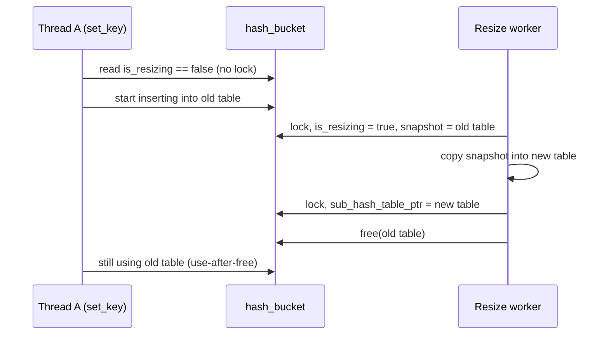

# Incident Report: TSan data races in hash-bucket resizing

| Field | Value |
|---|---|
| Date | 2026-09-28 |
| Branch | `task/pipeline_setup` (PR #5) |
| Failing job | `validate / Linux GCC TSan` (`.github/workflows/build-validation.yml`, `sanitizer` job) |
| Failing test | `concurrency_test` (CTest #2) |
| Severity | Critical: data race, use-after-free, lost writes |
| Status | Fixed; TSan `concurrency_test` passes locally (WSL, gcc-13, `halt_on_error=1`). CI rerun still pending |
| Related backlog item | `docs/progress.md`: "Resize guard TOCTOU fix: replace `resizing_lock` mutex → rwlock" |

---

## 1. Symptom

The CI TSan job failed with:

```
WARNING: ThreadSanitizer: data race
  Read of size 1 by thread T828:
    #0 upsert_node_to_hash_bucket   hash_bucket_operation.c:102
  Previous write of size 1 by thread T215 (mutexes: write M0):
    #0 initialize_hash_bucket_resizing   hash_bucket_resizing_operation.c:29
SUMMARY: ThreadSanitizer: data race hash_bucket_operation.c:102 in upsert_node_to_hash_bucket
```

The 1-byte location is `hash_bucket.is_resizing`.

After that race was fixed, a second one showed up. It had been hidden because `halt_on_error=1` stops at the first report:

```
WARNING: ThreadSanitizer: data race
  Read of size 8 by thread T1751 (mutexes: write M0):
    #0 get_node_from_resizing_buffer   buffer_operation.c:275
  Previous write of size 8 by thread T2001:
    #0 _perform_hash_bucket_resizing   resize_operation.c:80
SUMMARY: ThreadSanitizer: data race buffer_operation.c:275 in get_node_from_resizing_buffer
```

The 8-byte location is `resizing_buffer.new_sub_hash_table_ptr`.

---

## 2. Root cause

### 2.1 Issue 1: unlocked fast path on `is_resizing` (double-checked locking)

`upsert_node_to_hash_bucket`, `get_key_value_from_hash_bucket` and `delete_key_from_hash_bucket` read the plain `bool is_resizing` and `sub_hash_table_ptr` **without any lock**. When no resize was running, they operated directly on the live sub-hash-table. The resize code wrote both fields while holding `resizing_lock` (a `pthread_mutex_t`). The readers never took that lock, so nothing ordered the two sides.

TSan reported only the flag race. The same unlocked fast path also caused three bugs TSan could not see:

| # | Bug | Severity | Mechanism |
|---|---|---|---|
| 1a | Data race on `is_resizing` / `sub_hash_table_ptr` | Critical | Unlocked read vs. locked write (C11 undefined behaviour) |
| 1b | Use-after-free of the old sub-table | Critical | A thread passes the `!is_resizing` check and starts working in the old table. The resize worker then finishes, swaps in the new table, and runs `cleanup_sub_hash_table()` and `free_memory()` on the old one while that thread is still inside it |
| 1c | Lost writes | Critical | A fast-path writer inserts into the table after it became the resize snapshot and after `_fillup_new_sub_hash_table` already copied that sub-bucket. The key never reaches the new table |
| 1d | Double resize initialisation | High | Two threads both receive `SUCESS_ADDED_NEW_NODE_RESZING_TRIGGERED` and call `initialize_hash_bucket_resizing` in turn. Nothing re-checked `is_resizing`, so the second call leaked the first `resizing_buffer` and started a second worker on the same bucket |

Timeline for 1b:



### 2.2 Issue 2: unlocked publish/free of `new_sub_hash_table_ptr`

In `_perform_hash_bucket_resizing` (resize worker thread), two steps ran **without** `resizing_lock`:

- setting `resizing_buffer_ptr->new_sub_hash_table_ptr` after creating the new table;
- on a failed attempt, calling `cleanup_sub_hash_table()` and `free_memory()` on it, then setting it to `NULL`.

Meanwhile `get_node_from_resizing_buffer` reads that pointer from client threads while holding `resizing_lock`. Because the worker did not take the lock, the reader's lock gave no protection. On the retry path this was also a use-after-free: a reader could still be inside the table being freed.

---

## 3. Fix

### 3.1 Locking model (after fix)

`hash_bucket.resizing_lock` changed from `pthread_mutex_t` to **`pthread_rwlock_t`**:

| Caller | Lock mode | Why |
|---|---|---|
| Normal `set`/`get`/`delete` (not resizing) | **Shared** (`rdlock`), held for the whole operation | Operations still run in parallel with each other, but the table cannot be snapshotted or freed while any of them is inside it |
| Operations during a resize (`_resizing_lock_wrapper_for_hash_bucket_operation`) | **Exclusive** (`wrlock`) | Same serialisation as the old mutex |
| Resize start (`RESIZE_INITIALIZE`) | **Exclusive** | Waits for all in-flight fast-path operations to leave before taking the snapshot, which closes 1c |
| Resize finalize (`hash_bucket_resize_worker`) | **Exclusive** | Waits for all readers to leave before swapping and freeing the old table, which closes 1b |
| Publish/unpublish of `new_sub_hash_table_ptr` | **Exclusive** | Same lock the readers hold, which closes Issue 2 |
| `get_key_store_max_chain_depth` stats walk | **Shared**, per bucket | Stops the table being freed mid-walk |

Lock order is unchanged: `resizing_lock` → `sub_hash_bucket_lock` → data-node lock. No thread takes `resizing_lock` while holding a lower-level lock.

### 3.2 Code changes

| File | Change |
|---|---|
| `src/keystore/type_definitions/hash_bucket_type_definition.h` | `resizing_lock` type changed to `pthread_rwlock_t`; field doc updated |
| `src/keystore/hash_table/hash_bucket_operation.c` | `initialise_hash_bucket` / `cleanup_hash_bucket` use `pthread_rwlock_init` / `pthread_rwlock_destroy`. `upsert_…`, `get_…` and `delete_…` read `is_resizing` and run the sub-table operation under `rdlock`; if a resize is running, they release it and go through the exclusive wrapper. The wrapper uses `wrlock`. `cleanup_hash_bucket` polls `RESIZE_CHECK_STATUS` through the locked wrapper instead of reading `is_resizing` directly, guarded by `is_initialized` so uninitialised buckets are never locked |
| `src/keystore/hash_table/resizing/hash_bucket_resizing_operation.c` | `initialize_hash_bucket_resizing` returns `SUCCESS` without doing anything if `is_resizing` is already set (fixes 1d; it runs under the exclusive lock) |
| `src/keystore/hash_table/resizing/resize_operation.c` | Worker finalize uses `wrlock`/`unlock`. `_perform_hash_bucket_resizing` sets `new_sub_hash_table_ptr` under `wrlock`. On a failed attempt it clears the pointer under `wrlock`, then frees the table after unlocking, once no reader can reach it |
| `src/keystore/core/key_store.c` | `get_key_store_max_chain_depth` holds `rdlock` per bucket while scanning; the two early `continue`s were folded into one `if` so the lock is always released |

Fast-path pattern (upsert shown; get and delete follow the same shape):

```c
if (pthread_rwlock_rdlock(&hash_bucket_ptr->resizing_lock) != 0) return ERR_MUTEX_LOCK_ACQUIRE_FAILED;
bool is_resizing = hash_bucket_ptr->is_resizing;
if (!is_resizing) {
    result = (hash_bucket_ptr->sub_hash_table_ptr == NULL)
        ? ERR_SUB_HASH_TABLE_NOT_INITIALIZED
        : upsert_node_to_sub_hash_table(hash_bucket_ptr->sub_hash_table_ptr, key_hash, kv_pair);
}
if (pthread_rwlock_unlock(&hash_bucket_ptr->resizing_lock) != 0) return ERR_MUTEX_LOCK_RELEASE_FAILED;

if (is_resizing)
    result = _resizing_lock_wrapper_for_hash_bucket_operation(RESIZE_UPSERT_NODE, ...);  // exclusive
```

Public API and return codes are unchanged.

### 3.3 Alternatives considered

| Option | Rejected because |
|---|---|
| Make `is_resizing` an `atomic_bool` | Silences TSan but leaves the use-after-free, lost writes and double init. The flag can still change between the check and the table access |
| Take the existing mutex on every operation | Correct, but serialises every operation on a bucket even when no resize is running, which is a large throughput loss |
| RCU / hazard pointers | Correct and faster, but adds a lot of complexity and new dependencies for this fix |

---

## 4. Validation

| Environment | Build | `unit_tests` | `concurrency_test` |
|---|---|---|---|
| Windows, MinGW-w64 (`build/review-mingw-all`) | OK | Passed | Passed (212s and 153s; "Key missing after set: 0"). Run after the first fix only; the second fix was compile-checked on MinGW |
| WSL Ubuntu 24.04, gcc-13, `-DENABLE_SANITIZERS=thread`, `TSAN_OPTIONS=halt_on_error=1` (`build/tsan-wsl`) | OK | Passed | **Passed (61.1s), no ThreadSanitizer reports** |

Commands to reproduce the CI TSan job locally:

```bash
# inside WSL, from the repo root
cmake -S . -B build/tsan-wsl -DCMAKE_BUILD_TYPE=Debug \
  -DCMAKE_C_COMPILER=gcc-13 -DCMAKE_CXX_COMPILER=g++-13 \
  -DBUILD_UNIT_TESTS=ON -DBUILD_INTEGRATION_TESTS=ON -DBUILD_BENCHMARKS=OFF \
  -DENABLE_SANITIZERS=thread
cmake --build build/tsan-wsl --parallel
export TSAN_OPTIONS=halt_on_error=1
setarch "$(uname -m)" -R ctest --test-dir build/tsan-wsl --output-on-failure
```

> **WSL note:** without `setarch … -R` (ASLR off), gcc-13's TSan runtime aborts at startup with `FATAL: ThreadSanitizer: unexpected memory mapping`. This comes from the WSL kernel and has nothing to do with the code. GitHub runners do not need it.

---

## 5. Performance impact

- **No resize running:** each operation now takes one uncontended shared lock on its bucket. Operations still run in parallel with each other.
- **During a resize:** operations on that bucket were already serialised under the old mutex, and they still are.
- **Resize start and finalize:** these now wait for in-flight fast-path operations to finish. That wait is what makes the swap and free safe.
- **Measured:** the MinGW `concurrency_test` took 153–212s after the change. The ctest timing history suggested an average of about 71s before it, but the old code was not timed on the same machine, so how much of this is a regression is not established. Before relying on the numbers, re-measure with `benchmark/` (multi-thread) on Linux, where glibc rwlocks are much cheaper than winpthreads.
- **Possible follow-up:** glibc rwlocks favour readers by default, so under sustained read traffic a resize's exclusive lock can wait a long time. If benchmarks show this, set `PTHREAD_RWLOCK_PREFER_WRITER_NONRECURSIVE_NP` via `pthread_rwlockattr_setkind_np`, guarded by `#ifdef __GLIBC__`.

---

## 6. Follow-ups (not done in this change)

| Item | Severity | Notes |
|---|---|---|
| `_perform_hash_bucket_resizing`: `fill_result` and `task_uuid` are used without being set when `initialize_chase_worker` fails | High (undefined behaviour) | Initialise `fill_result = result` and skip `wait_for_chase_worker_to_finish` when the chase worker never started |
| Architecture docs still describe `resizing_lock` as a mutex and an unlocked fast path | Medium | `docs/architecture/01-overview.md`, `05-data-structures.md`, `07-concurrency-model.md`, `08-dynamic-resizing.md` |
| `docs/progress.md` still lists the rwlock change as a v1.1 backlog item | Low | Mark it done, with a reference to this report |
| More races may exist in the resize path (chase worker, operation buffers) | Medium | None showed up in the local TSan runs; confirm in CI and consider a dedicated resize-heavy stress test |
| Performance re-baseline | Medium | See section 5 |
